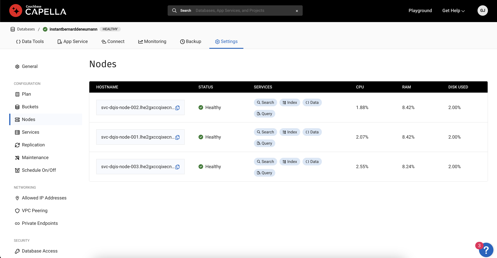

# PL/SQL To JsUDF tool

A tool that helps you migrate PL/SQL scripts to Couchbase.

**why?**</br>
You are an oracle user, you have migrated your data over to couchbase, now you try to hookup couchbase as your application's database, not so easy bulk of your business logic is in PL/SQL. You have to rewrite all of them to fit into couchbase's environment. That's where this tool comes in 💪

**How?**</br>
Automates translation of a PL/SQL script to Couchbase JavaScript library.
Antlr generated PL/SQL listener is used to pull out any Anonymous/Procedure/Function blocks. GPT is then prompted to translate a particular block to a javascript function that captures the operational semantics of the original PL/SQL block.

**Limitations:**</br>

1. Global Variables</br>
   In Couchbase a javascript library doesn't allow global variables whereas plsql support package level as well as cross package global variables

2. Case insensive fieldnames and table names</br>
   `SELECT CLICK, PIT FROM TEST WHERE Pit=2;` in PL/SQL the fieldnames `CLICK`, `PIT` and `Pit` , table `TEST` will all resolve to the right casing of the actual column. This however is not the same in couchbase, both fieldnames and tablenames are expected to be of the same casing as the one created in the datastore.

3. Date-time types</br>
   Oracle offers DATE and TIMESTAMP [data types](https://docs.oracle.com/en/database/oracle/oracle-database/12.2/heter/date-time-data-types.html#GUID-1FCC665C-67F1-494E-A98B-5DBEAE51C5E6) for representing dates, as well as various functions for manipulating and interacting with them. Couchbase, on the other hand, does not support datetime datatypes because JSON only allows for numbers, strings, and objects.

   Insert's would have to represent date-time as string or unix epoch time(integers).

   Any invocations of oracle's TO_DATE(), TO_CHAR(), EXTRACT() or any date specific functions would have to be rewriten using couchbase's [date time functions](https://docs.couchbase.com/server/7.2/n1ql/n1ql-language-reference/datefun.html)  

## Presetup

- as there is no concept of collections in oracle, for the experiments with the tool a    table is translated to `test`.`testcope`.`«table»`</br>
   create `test` bucket with `testscope` either through ui or:

   ```bash
   curl -u  <user:password> http://127.0.0.1:8091/pools/default/buckets -d name=test -d ramQuota=<as required>

   curl -u  <user:password> http://127.0.0.1:8091/pools/default/buckets/test/scopes  -d name=testscope
   ```

- implementation of workaround for logging expects `logging` bucket to be created, we use `_default`.`_default` collection to insert log.</br>
   create `logging` bucket:

   ```bash
   curl -u  <user:password> http://127.0.0.1:8091/pools/default/buckets -d name=logging -d ramQuota=100 
   ```

## Usage

download the executable from the [release](https://github.com/couchbaselabs/plsql-to-jsudf2/releases/tag/v1.0.0)

the executable expects the following command line arguments:

1. -u : capella signin email
2. -p : capella signin password
3. -cpaddr: capella-url for chat-completions api
4. -orgid:  organisation id in the chat-completions api path
5. -cbhost: node-ip: cbcluster node
6. -cbuser: cluster-user-name-> database user
7. -cbpassword: cluster-password-> database user's password 
8. -cbport: query-service tls port: usually 18093
9. filepath , i.e path to the PL/SQL script that has to be translated

**Aditional for capella users**</br>
-  `cbhost`</br>
`hostname` of a node with query service.


- `cbuser` and `cbpassword`</br>
create a database access with read/write on `test` and `logging` bucket: [create_database_access](https://docs.couchbase.com/cloud/clusters/manage-database-users.html#create-database-credentials)

**sample:**</br>

test PL/SQL:

`cat example1.sql`

```sql
DECLARE
   x NUMBER := 0;
   counter NUMBER := 0;
BEGIN
   FOR i IN 1..4 LOOP
      x := x + 1000;
      counter := counter + 1;
      INSERT INTO temp VALUES (x, counter, 'in OUTER loop');
       --start an inner block 
      DECLARE
         x NUMBER := 0;  -- this is a local version of x
      BEGIN
         FOR i IN 1..4 LOOP
            x := x + 1;  -- this increments the local x
            counter := counter + 1;
            INSERT INTO temp VALUES (x, counter, 'inner loop');
         END LOOP;
      END;
   END LOOP;
   COMMIT;
END;
```

Run the translator on the test PL/SQL:</br>

```bash
./plsql_to_jsudf -u «capella-signin-mailid» -p «capella-signin-password» -cpaddr https://api.cloud.couchbase.com -orgid «capella-organisation-id» -cbhost «hostname of data node» -cbuser «cbcluster username» -cbpassword «cbcluster password»  -cbport 18093 ./example1.sql
```

Output JsUDF:</br>

`cat output/example1.js`</br>

```js
function nestedloop(){
    var x = 0;
    var counter = 0;
    var querybegin = BEGIN WORK;
    querybegin.close();
    for (var i = 1; i <= 4; i++){
        x = x + 1000;
        counter = counter + 1;
        var params = [x, counter];
        var query = N1QL('INSERT INTO test.testscope.temp VALUES (uuid(),{"val1":$1,"val2":$2,"val3":"in OUTER loop"})',params);
        query.close();
        var x_inner = 0;
        for (var j = 1; j <= 4; j++){
            x_inner = x_inner + 1;
            counter = counter + 1;
            var params_inner = [x_inner, counter];
            var query_inner = N1QL('INSERT INTO test.testscope.temp VALUES (uuid(),{"val1":$1,"val2":$2,"val3":"inner loop"})',params_inner);
            query_inner.close();
        }
    }
    var querycommit = COMMIT WORK;
    querycommit.close();
}
```

## Workarounds for the limitations

1. `console.log` is not supported</br>
   `DBMS_OUTPUT.PUT` builtin procedure and other 2 similar builtins `DBMS_OUTPUT.PUT_LINE` and `DBMS_OUTPUT.NEW_LINE` are translated to `console.log()` but console.log is a browser api and is not supported by couchbase's Javascript evaluation implementation.
   This has been a common ask, considering couchbase eventing function does support `print()` statements but not in JsUdfs. </br>

   workaround:

      - User is expected to create \`logging\` bucket prior.
      - logs are inserted as part of a document INSERT into \`default\`.\`default\` collection. The document would look something like:

         ```json
         {
            "udf": «func-name»,
            "log": «argument to console.log», // the actual log line
            "time": «current ISO time string»
         }
         ```

      </br>
      User can lookup his logs by selecting on logging:</br>

      ```sql
      SELECT * FROM logging WHERE udf= "«func-name»";
      SELECT * FROM logging WHERE time BETWEEN "«date1»" AND "«date2»";
      ```

   An example:</br>
   original->

   ```sql
   BEGIN
      DBMS.OUTPUT.PUT("Hello world!");
   END;
   /
   ```

   translation->

   ```js
   function helloWorld() {
    
      // workaround for console.log("Hello world!");
      var currentDate = new Date();
      var utcISOString = currentDate.toISOString();
      var params = [utcISOString,'anonymousblock1',"Hello world!"];
      var logquery = N1QL('INSERT INTO logging VALUES(UUID(),{"udf":$2, "log":$3, "time":$1}, {"expiration": 5*24*60*60 })', params);
      logquery.close();
   }
   ```

   To view the log:

   ```sql
   EXECUTE FUNCTION helloWorld();
   "results": [
      null
   ]
   ```

   ```sql
   CREATE PRIMARY INDEX ON logging;
   "results": [
   ]
   ```

   ```sql
   SELECT * FROM logging;
   "results": [
      {"logging":{"log":"Hello world!","time":"2024-06-26T09:20:56.000Z","udf":"anonymousblock1"}}
   ]
   ```

2. Cross Package function calls:
   Procedures/Functions listed in the package specifcation are Global, and can be used from other packages via `«package_name».«public_procedure/function»`.
   But the same is not true for a Js Library, as import-export constructs are not supported by couchbase's Javascript evaluation implementation.</br>

   workaround:
      - incase of an interlibrary function call `«lib_name».«function»()`, user is expected to have the refrenced library «lib_name» already created, you can verify this via GET /evaluator/v1/libraries
      - the referenced function «function» also is expected created as a *global udf*, this can be verified via GET /admin/functions_cache or select system:functions keyspace. This way we can access the function via n1ql.

   An example:</br>
   math_utils Package

   ```sql
   CREATE OR REPLACE PACKAGE math_utils AS
      -- Public function to add two numbers
      FUNCTION add_numbers(p_num1 NUMBER, p_num2 NUMBER) RETURN NUMBER;
   END math_utils;
   /
   CREATE OR REPLACE PACKAGE BODY math_utils AS
      FUNCTION add_numbers(p_num1 NUMBER, p_num2 NUMBER) RETURN NUMBER IS
         BEGIN
            RETURN p_num1 + p_num2;
         END add_numbers;
   END math_utils;
   /
   ```

   show_sum Package

   ```sql
   CREATE OR REPLACE PACKAGE show_sum AS
      -- Public procedure to display the sum of two numbers
      PROCEDURE display_sum(p_num1 NUMBER, p_num2 NUMBER);
   END show_sum;
   /
   CREATE OR REPLACE PACKAGE BODY show_sum AS
      PROCEDURE display_sum(p_num1 NUMBER, p_num2 NUMBER) IS
         v_sum NUMBER;
      BEGIN
         -- Calling the add_numbers function from math_utils package
         v_sum := math_utils.add_numbers(p_num1, p_num2);
    
         -- Displaying the sum using DBMS_OUTPUT.PUT_LINE
         DBMS_OUTPUT.PUT_LINE('The sum of ' || p_num1 || ' and ' || p_num2 || ' is ' || v_sum);
      END display_sum;
   END show_sum;
   /
   ```

   Translated code:

   ```js
   function show_sum(a, b) {
    var sum_result;

   // Workaround for cross library function call math_utils.add_numbers(a, b)
   var crossfunc = N1QL("EXECUTE FUNCTION add_numbers($1,$2)",[a, b])
   var crossfuncres = []
   for(const doc of crossfunc) {
      crossfuncres.push(doc);
   }

   // actual replacement for math_utils.add_numbers(a, b)
       sum_result = crossfuncres[0];

    
   // workaround for console.log('The sum of ' + a + ' and ' + b + ' is: ' + sum_result);
   var currentDate = new Date();
   var utcISOString = currentDate.toISOString();
   var params = [utcISOString,'SHOW_SUM','The sum of ' + a + ' and ' + b + ' is: ' + sum_result];
   var logquery = N1QL('INSERT INTO logging VALUES(UUID(),{"udf":$2, "log":$3, "time":$1}, {"expiration": 5*24*60*60 })', params);
   logquery.close();
   }
   ```

3. Global Variables:</br>

   PL/SQL supports package level & session level global variables, but global variables are not supported in JsUdf deliberately by design as this cause concern for memory leaks.

   Suggested workaround requires manual tweaking of the generated translation.
   For example:

   ```sql
      CREATE OR REPLACE PACKAGE global_vars_pkg AS
        -- Global variable declarations
        g_counter NUMBER := 0;
        g_message VARCHAR2(100) := 'Initial Message';

        -- Public procedure declarations
        PROCEDURE increment_counter;
        PROCEDURE set_message(p_message VARCHAR2);
        PROCEDURE show_globals;
      END global_vars_pkg;
      /

      CREATE OR REPLACE PACKAGE BODY global_vars_pkg AS

        -- Procedure to increment the counter
        PROCEDURE increment_counter IS
        BEGIN
          g_counter := g_counter + 1;
        END increment_counter;

        -- Procedure to set the global message
        PROCEDURE set_message(p_message VARCHAR2) IS
        BEGIN
          g_message := p_message;
        END set_message;

        -- Procedure to display the current values of global variables
        PROCEDURE show_globals IS
        BEGIN
          DBMS_OUTPUT.PUT_LINE('g_counter = ' || g_counter);
          DBMS_OUTPUT.PUT_LINE('g_message = ' || g_message);
        END show_globals;

      END global_vars_pkg;
      /
   ```

   Any function the modifies global variable must accept it as an argument and return it to the caller.</br>

   - increment_counter:

      ```js
      function increment_counter(counter){
         counter = counter + 1;
         return counter
      }
      ```

   Any function that only reads a global can accept it as an argument.</br>

   - show_globals:

      ```js
      function show_globals(counter, message){
         // workaround for console.log(counter);
         var currentDate = new Date();
         var utcISOString = currentDate.toISOString();
         var params = [utcISOString,'SHOW_GLOBALS',couter];
         var logquery = N1QL('INSERT INTO logging VALUES(UUID(),{"udf":$2, "log":$3, "time":$1}, {"expiration": 5*24*60*60 })', params);
         logquery.close();

         // workaround for console.log(message);
         var currentDate = new Date();
         var utcISOString = currentDate.toISOString();
         var params = [utcISOString,'SHOW_GLOBALS',message];
         var logquery = N1QL('INSERT INTO logging VALUES(UUID(),{"udf":$2, "log":$3, "time":$1}, {"expiration": 5*24*60*60 })', params);
         logquery.close();
      }
      ```

**That wraps the workarounds for limitations discovered for now.**

## License

This project is licensed under the BSL 1.1 license - see the [LICENSE](LICENSE) file for details.
